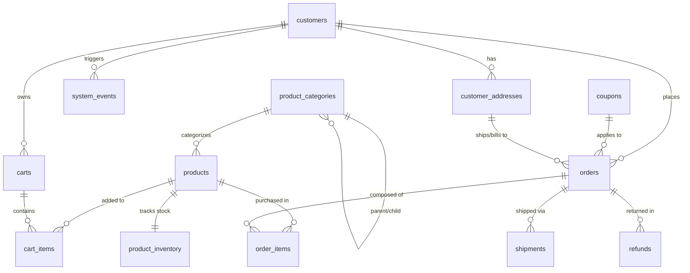

# AuraCart - Entity Relationship Diagram & Schema Description

This document defines the relational architecture, relationships, and key structures of the PostgreSQL Ecommerce database.

---

## 🗺 Entity Relationship Diagram (Mermaid)

---

## 📊 Table Schema Specifications

### 1. Customer Management
*   **`customers`**: Holds core user accounts. UUID values prevent sequential ID scraping. Includes enums for status and loyalty roles (regular, VIP, corporate), as well as `deleted_at` for soft-deletion.
*   **`customer_addresses`**: Handles physical customer addresses (shipping and billing). Maps default addresses (`is_default: boolean`) to streamline checkout flows.

### 2. Catalog & Inventory
*   **`product_categories`**: Self-referencing table supporting nested catalog trees (e.g., Electronics -> Laptops -> Accessories).
*   **`products`**: Central product records storing SKU codes, selling prices, and manufacturing costs (COGS).
*   **`product_inventory`**: Tracks real-time stock availability and custom warnings thresholds (`low_stock_threshold`).

### 3. Shopping Sessions & Cart
*   **`carts`**: Active shopping carts. Contains a nullable `customer_id` supporting guest checkout conversion.
*   **`cart_items`**: Junction table mapping products to shopping carts with desired quantities.

### 4. Transactions & Sales
*   **`orders`**: Captures paid, shipped, or returned transactions. Freezes total tax, shipping, and discounts at the time of purchase to ensure financial accounting reports remain static even if prices change.
*   **`order_items`**: Junction table storing the exact quantity, price, and *historical unit cost* of products purchased. Saving historical cost allows margins reporting to remain accurate over time.
*   **`coupons`**: Discount codes (welcome promos, percentage cuts, fixed deductions) validated by starts/ends dates and usage limits.

### 5. Supply Chain & Returns
*   **`shipments`**: Tracking details per order (FedEx, UPS, DHL), tracking codes, shipment status, and delivery dates.
*   **`refunds`**: Returns bookkeeping, tracking refund amount, approval status, and returned reason (damaged, wrong item, fraud).

### 6. Session Events
*   **`system_events`**: High-performance, JSONB-enabled clicks register. Tracks pageviews and cart conversions per session for funnel analytics.
